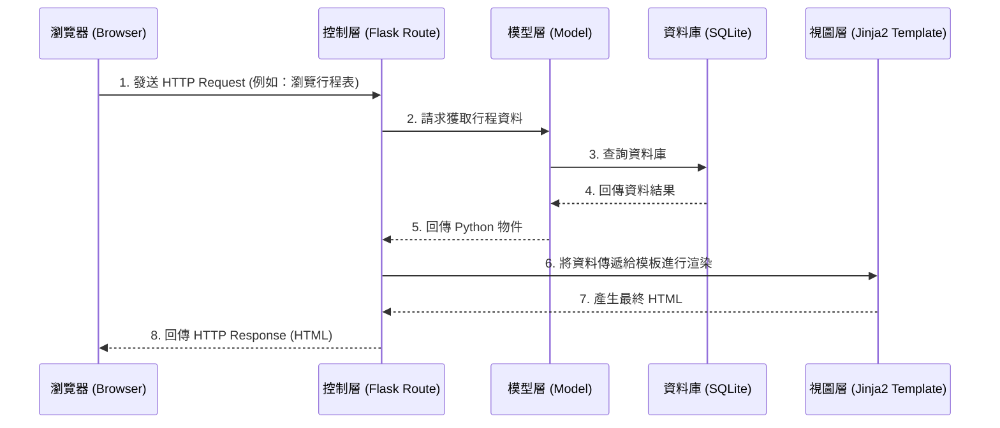

# 系統架構設計 (Architecture) - 旅遊網站系統

## 1. 技術架構說明

本專案採用經典的伺服器端渲染 (Server-Side Rendering) 架構，不採用前後端分離，以求快速開發與部署，非常適合此規模的應用程式。

### 選用技術與原因
- **後端框架：Python + Flask**
  - **原因**：Flask 輕量、靈活且學習曲線平緩，能快速建置路由與處理 HTTP 請求，非常適合用來開發中小型 Web 應用。
- **模板引擎：Jinja2**
  - **原因**：內建於 Flask 中，能方便地將後端資料動態渲染成 HTML 頁面。它支援流程控制與預設防止 XSS 攻擊的特性。
- **資料庫：SQLite (搭配 SQLAlchemy ORM)**
  - **原因**：SQLite 是單一檔案型資料庫，不需要額外架設資料庫伺服器，非常適合初期開發與本地測試。使用 SQLAlchemy 可以透過 Python 語法操作資料庫，提升可維護性。
- **前端技術：HTML5 + Vanilla CSS**
  - **原因**：使用原生技術確保網頁輕量化，並搭配 CSS Media Queries 實作 RWD 響應式網頁設計。

### Flask MVC 模式說明
雖然 Flask 本身沒有強制的目錄結構，但我們將採用類似 MVC (Model-View-Controller) 的設計模式：
- **Model (模型)**：負責定義資料結構與操作資料庫。
- **View (視圖)**：由 Jinja2 HTML 模板負責，接收資料並渲染成使用者看到的畫面。
- **Controller (控制器)**：由 Flask 的路由 (Routes) 負責，接收瀏覽器的請求、呼叫 Model 處理商業邏輯、最後把結果傳給 View 進行渲染。

## 2. 專案資料夾結構

以下為建議的資料夾結構與各元件說明：

```text
web_app_development/
├── app.py                # 應用程式入口點，負責啟動 Flask 伺服器
├── requirements.txt      # 專案相依套件清單 (例如: flask, flask-sqlalchemy, bcrypt)
├── README.md             # 專案說明文件
├── docs/                 # 放置 PRD, Architecture 等開發文件
│   ├── PRD.md
│   └── ARCHITECTURE.md
├── instance/             # 存放本地端設定或 SQLite 資料庫 (不進版控)
│   └── database.db
└── app/                  # 應用程式主目錄
    ├── __init__.py       # 初始化 Flask 應用與擴充套件
    ├── models/           # 模型層 (Models) - 定義資料庫表格與關聯
    │   ├── __init__.py
    │   ├── user.py       # 使用者模型
    │   ├── itinerary.py  # 行程模型
    │   └── place.py      # 景點與評價模型
    ├── routes/           # 控制層 (Controllers) - 處理各頁面的邏輯
    │   ├── __init__.py
    │   ├── auth.py       # 註冊/登入路由
    │   ├── main.py       # 首頁與景點瀏覽路由
    │   └── plan.py       # 行程與預算規劃路由
    ├── templates/        # 視圖層 (Views) - Jinja2 HTML 模板
    │   ├── base.html     # 共用版型 (包含導覽列與頁尾)
    │   ├── index.html    # 首頁
    │   ├── auth/         # 登入註冊相關頁面
    │   ├── places/       # 景點介紹相關頁面
    │   └── itineraries/  # 行程表相關頁面
    └── static/           # 靜態資源 (CSS, JS, 圖片)
        ├── css/
        │   └── style.css # 全域樣式與 RWD 設置
        ├── js/
        │   └── main.js   # 共用互動邏輯
        └── images/       # 專案圖片
```

## 3. 元件關係圖

以下展示使用者如何透過瀏覽器與我們的系統互動：



## 4. 關鍵設計決策

1. **採用 SQLAlchemy ORM 取代純 SQL 語法**
   - **原因**：將資料庫表映射為 Python 類別，避免在程式碼中撰寫大量容易出錯的字串 SQL 語句，並能預防常見的 SQL Injection 安全風險。
2. **採用 Blueprint 進行路由拆分**
   - **原因**：將 `routes` 拆分成 `auth.py`, `main.py`, `plan.py` 等模組，可避免所有路由集中在單一檔案導致難以維護，提升系統可擴展性。
3. **共用模板 (`base.html`) 的設計**
   - **原因**：利用 Jinja2 的模板繼承機制 (``)，確保整個網站的導覽列、CSS 引入、頁尾保持一致，減少重複程式碼。
4. **不使用 JavaScript 框架 (如 React/Vue)**
   - **原因**：根據 PRD 需求與技術限制，我們專注於使用 Flask + Jinja2 完成伺服器端渲染，僅在需要少量互動 (如表單驗證、彈出視窗) 時使用原生 JavaScript (Vanilla JS)。這讓系統架構保持單純。
