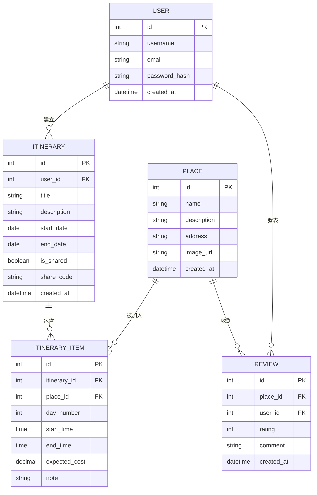

# 資料庫設計 (DB Design) - 旅遊網站系統

## 1. ER 圖（實體關係圖）

## 2. 資料表詳細說明

### USER (使用者表)
儲存使用者的基本與登入資訊。
- `id` (INTEGER): 主鍵，自動遞增
- `username` (VARCHAR): 使用者名稱，必填，唯一
- `email` (VARCHAR): 電子郵件，必填，唯一
- `password_hash` (VARCHAR): 加密後的密碼，必填
- `created_at` (DATETIME): 帳號建立時間

### ITINERARY (行程表)
儲存使用者建立的旅遊行程基本資料。
- `id` (INTEGER): 主鍵，自動遞增
- `user_id` (INTEGER): 外鍵，對應 USER.id，必填
- `title` (VARCHAR): 行程名稱，必填
- `description` (TEXT): 行程描述，選填
- `start_date` (DATE): 開始日期，必填
- `end_date` (DATE): 結束日期，必填
- `is_shared` (BOOLEAN): 是否開啟分享，預設 False
- `share_code` (VARCHAR): 分享專屬連結碼，唯一
- `created_at` (DATETIME): 行程建立時間

### PLACE (景點表)
儲存系統內建或使用者新增的景點資訊。
- `id` (INTEGER): 主鍵，自動遞增
- `name` (VARCHAR): 景點名稱，必填
- `description` (TEXT): 景點介紹，選填
- `address` (VARCHAR): 景點地址，選填
- `image_url` (VARCHAR): 景點圖片連結，選填
- `created_at` (DATETIME): 建立時間

### ITINERARY_ITEM (行程項目與預算表)
儲存每個行程中每一天的具體活動、景點安排與預估花費。
- `id` (INTEGER): 主鍵，自動遞增
- `itinerary_id` (INTEGER): 外鍵，對應 ITINERARY.id，必填
- `place_id` (INTEGER): 外鍵，對應 PLACE.id，可為空 (純自定義活動)
- `day_number` (INTEGER): 行程的第幾天，必填
- `start_time` (TIME): 開始時間，選填
- `end_time` (TIME): 結束時間，選填
- `expected_cost` (DECIMAL): 預估花費，預設 0
- `note` (TEXT): 備註，選填

### REVIEW (景點評價表)
儲存使用者對景點的評價與心得。
- `id` (INTEGER): 主鍵，自動遞增
- `place_id` (INTEGER): 外鍵，對應 PLACE.id，必填
- `user_id` (INTEGER): 外鍵，對應 USER.id，必填
- `rating` (INTEGER): 評分 (1~5)，必填
- `comment` (TEXT): 文字心得，選填
- `created_at` (DATETIME): 評價時間

## 3. SQL 建表語法
完整的 SQLite 建表語法已儲存於 `database/schema.sql`。

## 4. Python Model 程式碼
根據架構設計，採用 SQLAlchemy 作為 ORM，Model 檔案已建置於 `app/models/` 資料夾下，包含：
- `__init__.py`：初始化 db 物件
- `user.py`：User 模型
- `itinerary.py`：Itinerary 與 ItineraryItem 模型
- `place.py`：Place 與 Review 模型
