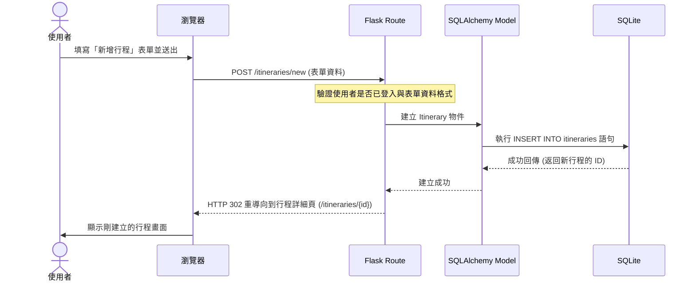

# 流程圖設計 (Flowchart) - 旅遊網站系統

本文件視覺化了使用者的操作路徑與系統內部的資料流，確保各項功能與系統架構的一致性。

## 1. 使用者流程圖 (User Flow)

此流程圖展示了使用者進入網站後，如何瀏覽景點、登入系統以及管理旅遊行程的完整路徑。

```mermaid
flowchart LR
    A([使用者開啟網頁]) --> B[首頁 - 景點探索與精選行程]
    B --> C{是否登入？}
    C -->|未登入| D[瀏覽景點介紹]
    C -->|未登入| E[登入 / 註冊頁面]
    E -->|登入成功| F[個人儀表板 (Dashboard)]
    
    C -->|已登入| F
    
    F --> G{要執行什麼操作？}
    G -->|瀏覽景點| D
    D -->|發表心得| H[填寫心得與評價表單]
    
    G -->|管理行程| I[行程表列表頁]
    I --> J{行程操作}
    J -->|新增| K[填寫行程基本資料]
    J -->|查看/編輯| L[進入單一行程詳細頁]
    J -->|刪除| M[刪除行程]
    
    L --> N{單一行程操作}
    N -->|新增活動/景點| O[選擇景點加入行程]
    N -->|管理預算| P[設定各項目預估花費]
    N -->|分享| Q[產生分享連結 (唯讀/共編)]
```

## 2. 系統序列圖 (Sequence Diagram)

以下以 **「使用者新增一筆旅遊行程」** 為例，展示瀏覽器、Flask 後端與資料庫之間的互動過程。



## 3. 功能清單對照表

本表列出了系統的主要功能、對應的 URL 路徑與 HTTP 方法，以供後續開發與 API 設計參考。

| 功能模組 | 具體功能 | URL 路徑 | HTTP 方法 |
| :--- | :--- | :--- | :--- |
| **會員系統** | 使用者註冊頁面 | `/auth/register` | GET |
| | 送出註冊資料 | `/auth/register` | POST |
| | 使用者登入頁面 | `/auth/login` | GET |
| | 送出登入資料 | `/auth/login` | POST |
| | 登出 | `/auth/logout` | GET / POST |
| **首頁與景點** | 網站首頁 | `/` | GET |
| | 景點列表 | `/places` | GET |
| | 景點詳細頁 | `/places/<place_id>` | GET |
| | 送出景點評價 | `/places/<place_id>/reviews` | POST |
| **行程管理** | 我的行程列表 | `/itineraries` | GET |
| | 建立新行程頁面 | `/itineraries/new` | GET |
| | 送出新行程 | `/itineraries/new` | POST |
| | 查看單一行程 | `/itineraries/<itinerary_id>` | GET |
| | 編輯單一行程 | `/itineraries/<itinerary_id>/edit` | GET, POST |
| | 刪除單一行程 | `/itineraries/<itinerary_id>/delete` | POST |
| **行程細節** | 新增活動/預算至行程 | `/itineraries/<itinerary_id>/items/new`| POST |
| | 刪除活動/預算項目 | `/itineraries/<itinerary_id>/items/<item_id>/delete`| POST |
| **分享與共編** | 查看分享的行程 | `/shared/<share_code>` | GET |
